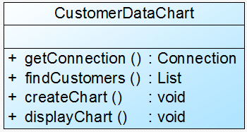
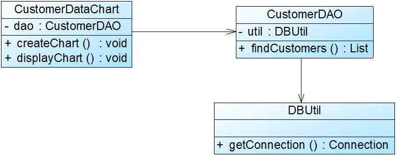
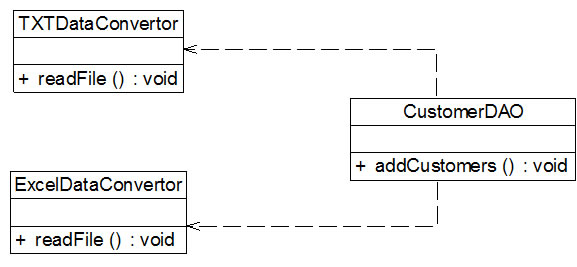

## 设计模式


### 一、概述

模式：在特定环境下人们解决某类重复出现问题的一套成功或有效的**解决方案**

软件模式(Software Patterns)：将模式的一般概念应用于软件开发领域，即软件开发的总体指导思路或参照样板。软件模式并非仅限于设计模式，还包括架构模式、分析模式和过程模式等，实际上，**在软件开发生命周期的每一个阶段都存在着一些被认同的模式**。

设计模式：用于在特定的条件下为一些重复出现的软件设计问题提供合理的、有效的解决方案

#### 1. 基础定义

设计模式：是一套被反复使用、多数人知晓的、经过分类编目的、代码设计经验的总结，使用设计模式是为了可重用代码、让代码更容易被他人理解并且保证代码可靠性

分类：

- 创建型(Creational)：如何创建对象
- 结构型(Structural)：如何实现类或对象的组合
- 行为型(Behavioral)：类或对象怎样交互以及怎样分配职责

#### 2. 列表

二十四种设计模式（包括简单工厂模式）

|   模式名称   | 学习难度 | 使用频率 |
| :----------: | :------: | :------: |
|   单例模式   |  ★☆☆☆☆   |  ★★★★☆   |
| 简单工厂模式 |  ★★☆☆☆   |  ★★★☆☆   |
| 工厂方法模式 |  ★★☆☆☆   |  ★★★★★   |
| 抽象工厂模式 |  ★★★★☆   |  ★★★★★   |
|   原型模式   |  ★★★☆☆   |  ★★★☆☆   |
|  建造者模式  |  ★★★★☆   |  ★★☆☆☆   |
|  适配器模式  |  ★★☆☆☆   |  ★★★★☆   |
|   桥接模式   |  ★★★☆☆   |  ★★★☆☆   |
|   组合模式   |  ★★★☆☆   |  ★★★★☆   |
|   装饰模式   |  ★★★☆☆   |  ★★★☆☆   |
|   外观模式   |  ★☆☆☆☆   |  ★★★★★   |
|   享元模式   |  ★★★★☆   |  ★☆☆☆☆   |
|   代理模式   |  ★★★☆☆   |  ★★★★☆   |
|  职责链模式  |  ★★★☆☆   |  ★★☆☆☆   |
|   命令模式   |  ★★★☆☆   |  ★★★★☆   |
|  解释器模式  |  ★★★★★   |  ★☆☆☆☆   |
|  迭代器模式  |  ★★★☆☆   |  ★★★★★   |
|  中介者模式  |  ★★★☆☆   |  ★★☆☆☆   |
|  备忘录模式  |  ★★☆☆☆   |  ★★☆☆☆   |
|  观察者模式  |  ★★★☆☆   |  ★★★★★   |
|   状态模式   |  ★★★☆☆   |  ★★★☆☆   |
|   策略模式   |  ★☆☆☆☆   |  ★★★★☆   |
| 模板方法模式 |  ★★☆☆☆   |  ★★★☆☆   |
|  访问者模式  |  ★★★★☆   |  ★☆☆☆☆   |

#### 3. 作用

> 1. 避免一些重复性的工作，有助于我们提高开发和设计效率，但它不保证一定会提高
> 2. 提供了一套通用的设计词汇和一种通用的形式来方便开发人员之间沟通和交流，使得设计方案更加通俗易懂
> 3. 兼顾了系统的可重用性和可扩展性，有利于系统的修改和维护
> 4. 有助于更快的了解系统
> 5. 有助于初学者更深入的理解面向对象的概念

#### 4. 思考

> 1. 设计模式的学习：设计模式的意图、解决的问题、如何解决的、适用情况、结构图、关键代码、应用实例、实战
> 2. 不要滥用设计模式，不要为了用而用
> 3. 模式从不保证任何东西，它不能保证你一定能够做出可复用的软件，提高你的生产率，更不能保证世界和平。模式并不能替代人来完成软件系统的创造，它们只不过会给那些缺乏经验但却具备才能和创造力的人带来希望。--John Vlissides (Pattern Hatching Design Patterns Applied)

### 二、面向对象设计原则

对于面向对象软件系统的设计而言，在支持**可维护性**的同时，提高系统的**可复用性**是一个至关重要的问题，可以说提高一个软件系统的可维护性和可复用性是面向对象设计需要解决的核心问题之一

| 设计原则名称 |                      定  义                      | 使用频率 |
| :----------: | :----------------------------------------------: | :------: |
| 单一职责原则 |       一个类只负责一个功能领域中的相应职责       |  ★★★★☆   |
|   开闭原则   |        软件实体应对扩展开放，而对修改关闭        |  ★★★★★   |
| 里氏代换原则 | 所有引用基类对象的地方能够透明地使用其子类的对象 |  ★★★★★   |
| 依赖倒转原则 |     抽象不应该依赖于细节，细节应该依赖于抽象     |  ★★★★★   |
| 接口隔离原则 |     使用多个专门的接口，而不使用单一的总接口     |  ★★☆☆☆   |
| 合成复用原则 |   尽量使用对象组合，而不是继承来达到复用的目的   |  ★★★★☆   |
|  迪米特法则  | 一个软件实体应当尽可能少地与其他实体发生相互作用 |  ★★★☆☆   |

#### 1. 单一职责原则

> **定义：**一个类只负责一个功能领域中的相应职责（就一个类而言，应该只有一个引起它变化的原因）
>
> 单一职责原则是实现**高内聚、低耦合**的指导方针，它是最简单但又最难运用的原则，需要设计人员发现类的不同职责并将其分离，而发现类的多重职责需要设计人员具有较强的分析设计能力和相关实践经验
>
> 
>
> CustomerDataChart类承担了太多的职责，单一职责原则优化方案：
>
> - DBUtil：负责连接数据库
> - CustomerDAO：负责操作数据库中的Customer表
> - CustomerDataChart：负责图表的生成和显示
>
> 

#### 2. 开闭原则

> **定义：**一个软件实体应当对扩展开放，对修改关闭。即**软件实体应尽量在不修改原有代码的情况下进行扩展**
>
> 其中软件实体可以指一个软件模块、一个由多个类组成的局部结构或一个独立的类
>
> 开闭原则是保证系统在拥有**适应性**和**灵活性**的同时具备较好的**稳定性**和**延续性**
>
> 抽象是开闭原则的关键，定义系统的抽象层，再通过具体类来进行扩展，如果要修改系统行为只需要新增具体类来实现新的业务
>
> 
>
> 将ChartDisplay中的方法抽象出来，放入具体的类
>
> 

#### 3. 里氏代换原则

> **定义：**所有引用基类（父类）的地方必须能透明地使用其子类的对象
>
> 在软件中将一个基类对象替换成它的子类对象，程序将不会产生任何错误和异常，反过来则不成立，如果一个软件实体使用的是一个子类对象的话，那么它不一定能够使用基类对象
>
> 里氏代换原则是实现开闭原则的重要方式之一，由于使用基类对象的地方都可以使用子类对象，所以在程序中尽量使用基类类型来对对象进行定义，而在运行时再确定其子类类型，用子类对象来替换父类对象
>
> **需要注意的问题**
>
> - 子类对象的所有方法必须在父类中声明，或子类必须实现父类中声明的所有方法
> - 尽量把父类设计成抽象类或接口，让子类继承或实现父类并实现父类中声明的方法
> -  Java语言中，在编译阶段，Java编译器会检查一个程序是否符合里氏代换原则，这是一个与实现无关的、纯语法意义上的检查，但Java编译器的检查是有局限的。
>
> 
>
> 根据里氏代换原则抽象后：
>
> 

#### 4. 依赖倒转原则

> **定义：**抽象不应该依赖于细节，细节应当依赖于抽象（**针对接口编程，而不是针对实现编程**）
>
> 依赖倒转原则要求我们在程序代码中传递参数时或在关联关系中，尽量引用层次高的抽象层类，即使用接口和抽象类进行变量类型声明、参数类型声明、方法返回类型声明，以及数据类型的转换等，而不要用具体类来做这些事情。为了确保该原则的应用，一个具体类应当只实现接口或抽象类中声明过的方法，而不要给出多余的方法，否则将无法调用到在子类中增加的新方法。
>
> 在引入抽象层后，系统将具有很好的灵活性，在程序中尽量使用抽象层进行编程，而将具体类写在配置文件中，这样一来，如果系统行为发生变化，**只需要对抽象层进行扩展，并修改配置文件**，而无须修改原有系统的源代码，在不修改的情况下来扩展系统的功能，满足开闭原则的要求。
>
> 在实现依赖倒转原则时，我们需要针对抽象层编程，而将具体类的对象通过**依赖注入(Dependency Injection,DI)**的方式注入到其他对象中，**依赖注入是指当一个对象要与其他对象发生依赖关系时，通过抽象来注入所依赖的对象**。常用的注入方式有三种，分别是：**构造注入，设值注入（Setter注入）和接口注入**
>
> 
>
> 更换数据转换类：通过配置文件的方式来修改
>
> 
>
> 在上述重构过程中，我们使用了开闭原则、里氏代换原则和依赖倒转原则，在大多数情况下，这三个设计原则会同时出现，**开闭原则是目标，里氏代换原则是基础，依赖倒转原则是手段**，它们相辅相成，相互补充，目标一致，只是分析问题时所站角度不同而已。

#### 5. 接口隔离原则

> **定义：** 使用多个专门的接口，而不使用单一的总接口，即客户端不应该依赖那些它不需要的接口
>
> 当一个接口太大时，我们需要将它分割成一些更细小的接口，使用该接口的客户端仅需知道与之相关的方法即可。**每一个接口应该承担一种相对独立的角色，不干不该干的事，该干的事都要干。**
>
> 这里的**接口**意义不同，接口隔离原则的表达方式以及含义有所不同：
>
> 1. 理解成一个类型所提供的所有方法特征的集合的时候，这就是一种逻辑上的概念，接口的划分将直接带来类型的划分。可以把接口理解成角色，一个接口只能代表一个角色，每个角色都有它特定的一个接口，此时，这个原则可以叫做“**角色隔离原则**”。
> 2. 理解成狭义的特定语言的接口，那么ISP表达的意思是指**接口仅仅提供客户端需要的行为，客户端不需要的行为则隐藏起来，应当为客户端提供尽可能小的单独的接口，而不要提供大的总接口**。
>
> 
>
> 根据接口隔离原则重构：
>
> 接口CustomerDataDisplay中定义了太多方法，即该接口承担了太多职责，一方面导致该接口的实现类很庞大，在不同的实现类中都不得不实现接口中定义的所有方法，灵活性较差，如果出现大量的空方法，将导致系统中产生大量的无用代码，影响代码质量；另一方面由于客户端针对大接口编程，将在一定程序上破坏程序的封装性，客户端看到了不应该看到的方法，没有为客户端定制接口。因此需要将该接口按照接口隔离原则和单一职责原则进行重构，将其中的一些方法封装在不同的小接口中，确保每一个接口使用起来都较为方便，并都承担某一单一角色，每个接口中只包含一个客户端（如模块或类）所需的方法即可。
>
> 
>
> **在使用接口隔离原则时，我们需要注意控制接口的粒度，接口不能太小，如果太小会导致系统中接口泛滥，不利于维护；接口也不能太大，太大的接口将违背接口隔离原则，灵活性较差，使用起来很不方便。** 一般而言，接口中仅包含为某一类用户定制的方法即可，不应该强迫客户依赖于那些它们不用的方法。

#### 6. 合成复用原则

> **定义：**尽量使用对象组合，而不是继承来达到复用的目的
>
> 在一个新的对象里通过关联关系（包括组合关系和聚合关系）来使用一些已有的对象，使之成为新对象的一部分；新对象通过委派调用已有对象的方法达到复用功能的目的。简言之：**复用时要尽量使用组合/聚合关系（关联关系），少用继承**。
>
> 面向对象设计中，可以通过两种方法在不同的环境中复用已有的设计和实现，即
>
> - **组合/聚合：**首先应该组合/聚合，可以使系统更加灵活，降低类与类之间的耦合度，一个类的变化对其他类造成的影响相对较少
>
> - **继承**：其次才考虑使用继承，并严格遵循里氏代换原则，有效使用继承会有助于对问题的理解，降低复杂度，而滥用继承反而会增加系统构建和维护的难度以及系统的复杂度，因此需要慎重使用继承复用。
>
> 如果两个类之间是“Has-A”的关系应使用组合或聚合，如果是“Is-A”关系可使用继承。"Is-A"是严格的分类学意义上的定义，意思是一个类是另一个类的"一种"；而"Has-A"则不同，它表示某一个角色具有某一项责任。
>
> 
>
>  根据合成复用原则，我们在实现复用时应该多用关联，少用继承：
>
> 
>
> 

#### 7. 迪米特法则

> **定义：**一个软件实体应当尽可能少地与其他实体发生相互作用
>
> 如果一个系统符合迪米特法则，那么当其中某一个模块发生修改时，就会尽量少地影响其他模块，扩展会相对容易，这是对软件实体之间通信的限制，迪米特法则要求限制软件实体之间通信的宽度和深度。**迪米特法则可降低系统的耦合度，使类与类之间保持松散的耦合关系。**
>
> 迪米特法则中，对于一个对象，其朋友包括以下几类：
>
> - 当前对象本身(this)；
> - 以参数形式传入到当前对象方法中的对象；
> - 当前对象的成员对象；
> - 如果当前对象的成员对象是一个集合，那么集合中的元素也都是朋友；
> - 当前对象所创建的对象。
>
> 迪米特法则要求我们在设计系统时，**应该尽量减少对象之间的交互，如果两个对象之间不必彼此直接通信，那么这两个对象就不应当发生任何直接的相互作用，如果其中的一个对象需要调用另一个对象的某一个方法的话，可以通过第三者转发这个调用**。简言之，就是**通过引入一个合理的第三者来降低现有对象之间的耦合度**。
>
> 注意下面的几点：**在类的划分上，应当尽量创建松耦合的类，类之间的耦合度越低，就越有利于复用，一个处在松耦合中的类一旦被修改，不会对关联的类造成太大波及**；**在类的结构设计上，每一个类都应当尽量降低其成员变量和成员函数的访问权限**；**在类的设计上，只要有可能，一个类型应当设计成不变类**；**在对其他类的引用上，一个对象对其他对象的引用应当降到最低**。
>
> 
>
> 可以通过引入一个专门用于控制界面控件交互的中间类(Mediator)来降低界面控件之间的耦合度。引入中间类之后，界面控件之间不再发生直接引用，而是将请求先转发给中间类，再由中间类来完成对其他控件的调用。当需要增加或删除新的控件时，只需修改中间类即可，无须修改新增控件或已有控件的源代码
>
> 


​	

### 三、设计模式详述


#### 1. 单例模式（对象唯一性）

Ensure a class has only one instance, and provide a global point of access to it.

确保某一个类只有一个实例，而且自行实例化并向整个系统提供这个实例。

> **优点**：
>
> - 提供了对唯一实例的受控访问
> - 节约系统资源
> - 允许可变数目的实例。基于单例模式我们可以进行扩展，使用与单例控制相似的方法来获得指定个数的对象实例，既节省系统资源，又解决了单例单例对象共享过多有损性能的问题。
>
> **缺点**：
>
> - 由于单例模式中没有抽象层，因此单例类的扩展有很大的困难
> - 单例类的职责过重，在一定程度上违背了“单一职责原则”。因为单例类既充当了工厂角色，提供了工厂方法，同时又充当了产品角色，包含一些业务方法，将产品的创建和产品的本身的功能融合到一起。
> - 很多面向对象语言(如Java、C#)的运行环境都提供了自动垃圾回收，如果实例化的共享对象长时间不被利用，系统会认为它是垃圾，会自动销毁并回收资源，下次利用时又将重新实例化，这将导致共享的单例对象状态的丢失。
>
> **适用场景：**
>
> - 系统只需要一个实例对象，如系统要求提供一个唯一的序列号生成器或资源管理器，或者需要考虑资源消耗太大而只允许创建一个对象
> - 客户调用类的单个实例只允许使用一个公共访问点，除了该公共访问点，不能通过其他途径访问该实例

##### 1.1 简单单例模式

```java
// 存在问题：多线程情况下会不是单例
public class SimpleSingleton {

    private SimpleSingleton(){}

    private static SimpleSingleton simpleSingleton = null;

    public static SimpleSingleton getInstance(){
        if (simpleSingleton == null){
            simpleSingleton = new SimpleSingleton();
        }
        return simpleSingleton;
    }
}
```

##### 1.2 饿汉式单例模式

优点：无需考虑多线程问题，初始化创建，使用时速度快

缺点：资源利用率低，系统启动加载时间长

```java
// 类加载时候创建单例对象，不会出现创建多个单例对象的情况，可确保单例对象的唯一性
public class EagerSingleton {
    private EagerSingleton(){}

    private static final EagerSingleton EAGER_SINGLETON = new EagerSingleton();

    private static EagerSingleton getInstance(){
        return EAGER_SINGLETON;
    }
}
```

##### 1.3 懒汉式单例模式与线程锁定

优点：延迟加载，资源利用率高

缺点：使用时创建，需要进行双重检查锁，性能低

```java
public class LazySingleton {
    private LazySingleton(){}

    private static volatile LazySingleton lazySingleton = null;

    // 性能降低
    synchronized public static LazySingleton getInstance1(){
        if (lazySingleton == null){
            lazySingleton = new LazySingleton();
        }
        return lazySingleton;
    }
    // 多线程情况下，会出现多个对象（当两个线程都通过了lazySingleton == null判断的时候）
    public static LazySingleton getInstance2(){
        if (lazySingleton == null){
            synchronized (LazySingleton.class){
                lazySingleton = new LazySingleton();
            }
        }
        return lazySingleton;
    }

    // double-check机制，需要在 lazySingleton 前加 volatile关键字，禁止jvm重排序
    public static LazySingleton getInstance3(){
        if (lazySingleton == null){
            synchronized (LazySingleton.class){
                if (lazySingleton == null){
                    lazySingleton = new LazySingleton();
                }
            }
        }
        return lazySingleton;
    }
}
```

##### 1.4 静态内部类方式

Initialization Demand Holder

JVM在类的初始化阶段，JVM会去获取一个锁。这个锁可以同步多个线程对同一个类的初始化。

优点：既可以实现延迟加载，又可以保证线程安全，不影响系统性能

```java
public class IoDHSingleton {

    private IoDHSingleton(){}

    private static class SingletonHolder{
        private final static IoDHSingleton IO_DH_SINGLETON = new IoDHSingleton();
    }

    public static IoDHSingleton getInstance(){
        return SingletonHolder.IO_DH_SINGLETON;
    }
}
```

#### 2. 简单工厂模式

> **简单工厂模式角色**
>
> 
>
> - Factory：负责实现创建所有产品实例的内部逻辑
> - Product 抽象产品：所有对象的父类，封装了各种产品对象的公有方法，提高系统的灵活性
> - Concrete Product 具体产品：创建目标
>
> **优点：**
>
> - 工厂类负责逻辑判断，客户端可免除创建产品对象，从而直接消费即可
> - 客户端只需提供相应的参数
> - 可以通过引入配置文件，在不更改代码的情况下，更换或添加具体的产品类，提高系统的**灵活性**
>
> **缺点：**
>
> - 工厂类集中所有产品的创建逻辑，职责过重
> - 增加系统中类的个数，系统复杂度和理解难度增加
> - 系统扩建困难，必须改工厂逻辑
> - 简单工厂模式由于使用了静态工厂方法，使工厂角色无法形成基于继承的等级结构
>
> **适用场景：**
>
> - 工厂类负责创建的对象较少，不会使其中的业务逻辑太复杂
> - 客户端只知道工厂类的参数，不关心如何创建对象


#### 3. 工厂方法模式

> **工厂方法模式角色**
>
> 
>
> - product（抽象产品）：产品接口
> - concrete product（具体产品）：产品实现类
> - Factory（抽象工厂）：声明了工厂方法，所有创建对象的工厂类必须实现该接口
> - concrete factory(具体工厂)：实现了抽象工厂中定义的工厂方法，返回一个具体产品类的实例。
>
> **反射与配置文件：**通过配置文件的方式，实现可扩展性和灵活性
>
> ```java
> // 新增产品种类的时候步骤
> (1) 新的日志记录器需要继承抽象日志记录器Logger；
> (2) 对应增加一个新的具体日志记录器工厂，继承抽象日志记录器工厂LoggerFactory，并实现其中的工厂方法createLogger()，设置好初始化参数和环境变量，返回具体日志记录器对象；
> (3) 修改配置文件config.xml，将新增的具体日志记录器工厂类的类名字符串替换原有工厂类类名字符串；
> (4) 编译新增的具体日志记录器类和具体日志记录器工厂类，运行客户端测试类即可使用新的日志记录方式，而原有类库代码无须做任何修改，完全符合“开闭原则”。
> ```
>
> **工厂方法重载：**提供多种方式初始化产品
>
> **工厂方法隐藏：**在工厂类中直接调用业务方法
>
> 
>
> **优点**
>
> - 工厂方法用来创建客户所需要的产品，同时还向客户隐藏了哪种具体产品类将被实例化这一细节，用户只需要关心所需产品对应的工厂，无须关心创建细节，甚至无须知道具体产品类的类名
> - 基于工厂角色和产品角色的多态性设计是工厂方法模式的关键，让工厂可以自主确定创建何种产品对象，而如何创建这个对象的细节则完全封装在具体工厂内部。工厂方法模式之所以又被称为**多态工厂模式**，就正是因为所有的具体工厂类都具有同一抽象父类。
> - 在系统中加入新产品时，无须修改抽象工厂和抽象产品提供的接口，无须修改客户端，也无须修改其他的具体工厂和具体产品，而只要添加一个具体工厂和具体产品，完全符合“开闭原则”
>
> **缺点**
>
> - 每个产品对应工厂类，增加系统复杂度
> - 统的可扩展性，需要引入抽象层，在客户端代码中均使用抽象层进行定义，增加了系统的抽象性和理解难度，且在实现时可能需要用到DOM、反射等技术，增加了系统的实现难度
>
> **适用场景**
>
> - 客户端不知道它所需要的对象的类，只需要知道所对应的工厂即可
> - 抽象工厂类通过其子类来指定创建哪个对象，利用面向对象的多态性和里氏代换原则，在程序运行时，子类对象将覆盖父类对象，从而使得系统更容易扩展。


#### 4. 抽象工厂模式

> **产品等级结构：**产品等级结构即产品的继承结构，抽象类电视机和品牌电视机的等级结构
>
> **产品族：**由同一工厂生产的，位于不同产品等级结构中的一组产品
>
> **当一个工厂等级结构可以创建出分属于不同产品等级结构的一个产品族中的所有对象时，抽象工厂模式比工厂方法模式更为简单、更有效率**
>
> **抽象工厂模式角色**
>
> 
>
> - Abstract Factory（抽象工厂）： 它声明了**一组用于创建一族产品的方法**，每一个方法对应一种产品。
>
> - Concrete Factory（具体工厂）： 它实现了在抽象工厂中声明的创建产品的方法，生成一组具体产品，这些产品构成了一个产品族，每一个产品都位于某个产品等级结构中。
>
> - Abstract Product（抽象产品） 它为每种产品声明接口，在抽象产品中声明了产品所具有的业务方法。
>
> - Concrete Product（具体产品） 它定义具体工厂生产的具体产品对象，实现抽象产品接口中声明的业务方法。
>
> 同工厂方法类似，抽象工厂模式同样可以通过 **配置反射、方法重载**等方式实现灵活性和扩展性
>
> **开闭原则的倾斜性：**
>
> 在抽象工厂模式中，增加新的产品族很方便，但是增加新的产品等级结构很麻烦，这种特点称为开闭原则的倾斜性。
>
> 开闭原则要求：系统对扩展开放，对修改封闭，通过扩展达到增强其功能的目的
>
> 对于多产品族和产品等级结构的系统来说，功能增强包括**增加产品族、增加产品等级结构**。但抽象工厂模式在满足开闭原则的情况下**只能增加产品族**，因此要求设计人员在设计之初就能够全面考虑，不会在设计完成之后向系统中增加新的产品等级结构，也不会删除已有的产品等级结构，否则将会导致系统出现较大的修改，为后续维护工作带来诸多麻烦。
>
> **优点**
>
> - 隔离了具体类的生成，使得客户并不需要知道什么被创建，更换一个具体工厂就变得相对容易
> - 当一个产品族中的多个对象被设计成一起工作时，它能够保证客户端始终只使用同一个产品族中的对象
> - 增加新的产品族很方便，无须修改已有系统，符合“开闭原则”
>
> **缺点**
>
> - 增加新的产品等级结构麻烦，需要对原有系统进行较大的修改，甚至需要修改抽象层代码，这显然会带来较大的不便，违背了“开闭原则”。
>
> **适用场景**
>
> - 一个系统不应当依赖于产品类实例如何被创建、组合和表达的细节，这对于所有类型的工厂模式都是很重要的，用户无须关心对象的创建过程，将对象的创建和使用解耦
> - 系统中有多于一个的产品族，而每次只使用其中某一产品族。可以通过配置文件等方式来使得用户可以动态改变产品族，也可以很方便地增加新的产品族。
> - 属于同一个产品族的产品将在一起使用，这一约束必须在系统的设计中体现出来。
> - 产品等级结构稳定，设计完成之后，不会向系统中增加新的产品等级结构或者删除已有的产品等级结构


#### 5. 原型模式（对象克隆）

Specify the kinds of objects to create using a prototypical instance,and create new objects by copying this prototype.

用原型实例指定创建对象的种类， 并且通过拷贝这些原型创建新的对象。

> **原型模式角色**
>
> 
>
> - prototype（抽象原型类）：声明克隆方法的接口，是所有具体原型类的公共父类。可以是抽象类、接口、具体实现类
> - concrete prototype (具体原型类)：实现在抽象原型类中声明的克隆方法，在克隆方法中返回自己的一个克隆对象
> - Client（客户类）：让一个原型对象克隆自身从而创建一个新的对象，在客户类中只需要直接实例化或通过工厂方法等方式创建一个原型对象，再通过调用该对象的克隆方法即可得到多个相同的对象。由于客户类针对抽象原型类Prototype编程，因此用户可以根据需要选择具体原型类，系统具有较好的可扩展性，增加或更换具体原型类都很方便。
>
> **克隆方法**
>
> ```java
> // 1.通用的克隆实现方法是在具体原型类的克隆方法中实例化一个与自身类型相同的对象并将其返回，并将相关的参数传入新创建的对象中，保证它们的成员属性相同
> class ConcretePrototype implements Prototype{
> private String  attr; //成员属性
> public void  setAttr(String attr){
>     this.attr = attr;
> }
> public String  getAttr(){
>    return this.attr;
> }
>  
> public Prototype  clone(){ //克隆方法
>    Prototype  prototype = new ConcretePrototype(); //创建新对象
>    prototype.setAttr(this.attr);
>    return prototype;
> }
> }
> 
> // 2. 使用Object提供的clone()方法来实现对象的克隆
> class ConcretePrototype implements  Cloneable{
> 
> ……
>  
> public Prototype  clone(){
> 　　Object object = null;
> 　　try {
> 　　　　　object = super.clone();
> 　　} catch (CloneNotSupportedException exception) {
> 　　　　　System.err.println("Not support cloneable");
> 　　}
> 　　return (Prototype )object;
> }
> }
> 
> ```
>
> **浅克隆与深克隆**
>
> - 浅克隆
>
> 值类型--复制一份，引用类型--复制地址，
>
> 当对象被复制时只复制它本身和其中包含的值类型的成员变量，而引用类型的成员对象并没有复制
>
> - 深克隆
>
> 无论是值类型还是引用类型都会复制一份给克隆对象
>
> 即：除了对象本身被复制外，对象所包含的所有成员变量也将复制
>
> 实现深克隆可以通过序列化等方式实现，**序列化**就是将对象写到流的过程，写到流中的对象是原有对象的一个拷贝，而原对象仍然存在于内存中。
>
> **注意：**够实现序列化的对象其类必须实现Serializable接口，否则无法实现序列化操作
>
> 
>
> **原型管理器(Prototype Manager)：**
>
> 将多个原型对象存储在一个集合中供客户端使用，它是一个专门负责克隆对象的工厂，其中定义了一个集合用于存储原型对象，如果需要某个原型对象的一个克隆，可以通过复制集合中对应的原型对象来获得
>
> **优点**
>
> - 当创建新的对象实例较为复杂时，使用原型模式可以简化对象的创建过程，通过复制一个已有实例可以提高新实例的创建效率。
> -  扩展性较好，由于在原型模式中提供了抽象原型类，在客户端可以针对抽象原型类进行编程，而将具体原型类写在配置文件中，增加或减少产品类对原有系统都没有任何影响
> - 原型模式提供了简化的创建结构，复制是通过封装在原型类中的克隆方法实现的，无须专门的工厂类来创建产品
> - 可以使用深克隆的方式保存对象的状态，使用原型模式将对象复制一份并将其状态保存起来，以便在需要的时候使用（如恢复到某一历史状态），可辅助实现撤销操作
>
> **缺点**
>
> - 需要为每一个类配备一个克隆方法，而且该克隆方法位于一个类的内部，当对已有的类进行改造时，需要修改源代码，违背了“开闭原则”
> - 在实现深克隆时需要编写较为复杂的代码，而且当对象之间存在多重的嵌套引用时，为了实现深克隆，每一层对象对应的类都必须支持深克隆，实现起来可能会比较麻烦
>
> **适用场景**
>
> - 创建新对象成本较大（如初始化需要占用较长的时间，占用太多的CPU资源或网络资源），新的对象可以通过原型模式对已有对象进行复制来获得，如果是相似对象，则可以对其成员变量稍作修改
> - 如果系统要保存对象的状态，而对象的状态变化很小，或者对象本身占用内存较少时，可以使用原型模式配合备忘录模式来实现
> - 需要避免使用分层次的工厂类来创建分层次的对象，并且类的实例对象只有一个或很少的几个组合状态，通过复制原型对象得到新实例可能比使用构造函数创建一个新实例更加方便


#### 6. 建造者模式（复杂对象的组装与创建）

> **建造者模式角色**
>
> 
>
> - Builder（抽象建造者）：它为创建一个产品Product对象的各个部件指定抽象接口，在该接口中一般声明两类方法，一类方法是buildPartX()，它们用于创建复杂对象的各个部件；另一类方法是getResult()，它们用于返回复杂对象。Builder既可以是抽象类，也可以是接口。
> - Concrete Builder（具体建造者）：它实现了Builder接口，实现各个部件的具体构造和装配方法，定义并明确它所创建的复杂对象，也可以提供一个方法返回创建好的复杂产品对象
> - Product（产品角色）：它是被构建的复杂对象，包含多个组成部件
> - Director（指挥者）：负责安排复杂对象的建造次序，指挥者与抽象建造者之间存在关联关系，可以在其construct()建造方法中调用建造者对象的部件构造与装配方法，完成复杂对象的建造。客户端一般只需要与指挥者进行交互，在客户端确定具体建造者的类型，并实例化具体建造者对象（也可以通过配置文件和反射机制），然后通过指挥者类的构造函数或者Setter方法将该对象传入指挥者类中。
>
> **Director的使用**
>
> - **省略director**：将construct方法写入builder中
>
> 加重了抽象建造者类的职责，如果construct()方法较为复杂，待构建产品的组成部分较多，建议还是将construct()方法单独封装在Director中，这样做更符合“单一职责原则”。
>
> - **钩子方法的引入**：来具体控制是否对某个buildPartX进行调用
>
> **优点**
>
> - 在建造者模式中，客户端不必知道产品内部组成的细节，将产品本身与产品的创建过程解耦，使得相同的创建过程可以创建不同的产品对象
> - 每一个具体建造者都相对独立，而与其他的具体建造者无关，因此可以很方便地替换具体建造者或增加新的具体建造者，用户使用不同的具体建造者即可得到不同的产品对象。由于指挥者类针对抽象建造者编程，增加新的具体建造者无须修改原有类库的代码，系统扩展方便，符合“开闭原则”
> - 可以更加精细地控制产品的创建过程。将复杂产品的创建步骤分解在不同的方法中，使得创建过程更加清晰，也更方便使用程序来控制创建过程。
>
> **缺点**
>
> - 建造者模式所创建的产品一般具有较多的共同点，其组成部分相似，如果产品之间的差异性很大，例如很多组成部分都不相同，不适合使用建造者模式，因此其使用范围受到一定的限制
> - 如果产品的内部变化复杂，可能会导致需要定义很多具体建造者类来实现这种变化，导致系统变得很庞大，增加系统的理解难度和运行成本
>
> **适用场景**
>
> - 需要生成的产品对象有复杂的内部结构，这些产品对象通常包含多个成员属性
> - 需要生成的产品对象的属性相互依赖，需要指定其生成顺序
> - 对象的创建过程独立于创建该对象的类。在建造者模式中通过引入了指挥者类，将创建过程封装在指挥者类中，而不在建造者类和客户类中。
> - 隔离复杂对象的创建和使用，并使得相同的创建过程可以创建不同的产品


#### 7. 适配器模式（不兼容结构的协调）

##### 7.1 基础适配器

> **定义：**将一个接口转换成客户希望的另一个接口，使接口不兼容的那些类可以一起工作，其别名为包装器(Wrapper)。适配器模式既可以作为类结构型模式，也可以作为对象结构型模式。
>
> 在适配器模式中，我们通过增加一个新的适配器类来解决接口不兼容的问题，使得原本没有任何关系的类可以协同工作。根据适配器类与适配者类的关系不同，适配器模式可分为对象适配器和类适配器两种，**在对象适配器模式中，适配器与适配者之间是关联关系；在类适配器模式中，适配器与适配者之间是继承（或实现）关系**。
>
> **适配器角色：**
>
>                                                                                            对象适配器模式
>
>                                                                                             类适配器
>
> - **Target（目标抽象类）：** 目标抽象类定义客户所需接口，可以是一个抽象类或接口，也可以是具体类
> - **Adaptee（适配者类）：** 适配者即被适配的角色，它定义了一个已经存在的接口，这个接口需要适配，适配者类一般是一个具体类，包含了客户希望使用的业务方法，在某些情况下可能没有适配者类的源代码
> -  **Adapter（适配器类）：** 适配器可以调用另一个接口，作为一个转换器，对Adaptee和Target进行适配，适配器类是适配器模式的核心，在对象适配器中，它通过继承Target并关联一个Adaptee对象使二者产生联系
>
> 类适配器与对象适配器：**适配器和适配者之间的关系不同，对象适配器模式中适配器和适配者之间是关联关系，而类适配器模式中适配器和适配者是继承关系**
>
> ```java
> // 典型的对象适配器代码,java中较多使用对象适配器
> class Adapter extends Target {
>      private Adaptee adaptee; //维持一个对适配者对象的引用
>      public Adapter(Adaptee adaptee) {
>        this.adaptee=adaptee;
>      }
>      public void request() {
>        adaptee.specificRequest(); //转发调用
>      }
>  }
> 
> // 典型的类适配器代码
> class Adapter extends Adaptee implements Target {
>         public void request() {
>             specificRequest();
>         }
> }
> ```
>

##### 7.2 双向适配器：（很少使用）

>
> 
>
> ```java
> class Adapter implements Target,Adaptee {
>     //同时维持对抽象目标类和适配者的引用
>     private Target target;
>     private Adaptee adaptee;
> 
>     public Adapter(Target target) {
>         this.target = target;
>     }
> 
>     public Adapter(Adaptee adaptee) {
>         this.adaptee = adaptee;
>     }
> 
>     public void request() {
>         adaptee.specificRequest();
>     }
> 
>     public void specificRequest() {
>         target.request();
>     }
> }
> ```
>

##### 7.3  缺省适配器模式

> 缺省适配器模式(Default Adapter Pattern)：当不需要实现一个接口所提供的所有方法时，可先设计一个抽象类实现该接口，并为接口中每个方法提供一个默认实现（空方法），那么该抽象类的子类可以选择性地覆盖父类的某些方法来实现需求，它适用于不想使用一个接口中的所有方法的情况，又称为单接口适配器模式。
>
> **缺省适配器模式角色：**
>
> 
>
> - **ServiceInterface（适配者接口）：** 它是一个接口，通常在该接口中声明了大量的方法
> - **AbstractServiceClass（缺省适配器类）：** 它是缺省适配器模式的核心类，使用空方法的形式实现了在ServiceInterface接口中声明的方法。通常将它定义为抽象类，因为对它进行实例化没有任何意义
> -  **ConcreteServiceClass（具体业务类）：** 它是缺省适配器类的子类，在没有引入适配器之前，它需要实现适配者接口，因此需要实现在适配者接口中定义的所有方法，而对于一些无须使用的方法也不得不提供空实现。在有了缺省适配器之后，可以直接继承该适配器类，根据需要有选择性地覆盖在适配器类中定义的方法

##### 7.4 适配者总结

> 优点：
>
> - **将目标类和适配者类解耦**，通过引入一个适配器类来重用现有的适配者类，无须修改原有结构
> - **增加了类的透明性和复用性**，将具体的业务实现过程封装在适配者类中，对于客户端类而言是透明的，而且提高了适配者的复用性，同一个适配者类可以在多个不同的系统中复用
> - **灵活性和扩展性都非常好**，通过使用配置文件，可以很方便地更换适配器，也可以在不修改原有代码的基础上增加新的适配器类，完全符合“开闭原则”
>
> 类适配器优点：
>
> - 由于适配器类是适配者类的子类，因此**可以在适配器类中置换一些适配者的方法**，使得适配器的灵活性更强。
>
> 对象适配器优点：
>
> - 一个对象适配器**可以把多个不同的适配者适配到同一个目标**；
> - **可以适配一个适配者的子类**，由于适配器和适配者之间是关联关系，根据“里氏代换原则”，适配者的子类也可通过该适配器进行适配。
>
> 
>
> **缺点：**
>
> 类适配器缺点：
>
> - 对于Java、C#等不支持多重类继承的语言，一次最多只能适配一个适配者类，**类适配器不能同时适配多个适配者**；
> - **适配者类不能为最终类**，如在Java中不能为final类，C#中不能为sealed类；
> - 在Java、C#等语言中，**类适配器模式中的目标抽象类只能为接口，不能为类**，其使用有一定的局限性。
>
> 对象适配器模式缺点：
>
> 与类适配器模式相比，**要在适配器中置换适配者类的某些方法比较麻烦**。如果一定要置换掉适配者类的一个或多个方法，可以先做一个适配者类的子类，将适配者类的方法置换掉，然后再把适配者类的子类当做真正的适配者进行适配，实现过程较为复杂。
>
> 
>
> **适用场景：**
>
> - 系统需要使用一些现有的类，而这些类的接口（如方法名）不符合系统的需要，甚至没有这些类的源代码。
> - 想创建一个可以重复使用的类，用于与一些彼此之间没有太大关联的一些类，包括一些可能在将来引进的类一起工作。


#### 8. 桥接模式（多维度变化）

> **定义：**将抽象部分与它的实现部分分离，使它们都可以独立地变化。它是一种对象结构型模式，又称为柄体(Handle and Body)模式或接口(Interface)模式。
>
> **桥接模式角色：**
>
> 
>
> - Abstraction（抽象类）：用于定义抽象类的接口，它一般是抽象类而不是接口，其中定义了一个Implementor（实现类接口）类型的对象并可以维护该对象，它与Implementor之间具有关联关系，它既可以包含抽象业务方法，也可以包含具体业务方法。
> - RefinedAbstraction（扩充抽象类）：扩充由Abstraction定义的接口，通常情况下它不再是抽象类而是具体类，它实现了在Abstraction中声明的抽象业务方法，在RefinedAbstraction中可以调用在Implementor中定义的业务方法。
> - Implementor（实现类接口）：定义实现类的接口，这个接口不一定要与Abstraction的接口完全一致，事实上这两个接口可以完全不同，一般而言，Implementor接口仅提供基本操作，而Abstraction定义的接口可能会做更多更复杂的操作。Implementor接口对这些基本操作进行了声明，而具体实现交给其子类。通过关联关系，在Abstraction中不仅拥有自己的方法，还可以调用到Implementor中定义的方法，使用关联关系来替代继承关系。
> - ConcreteImplementor（具体实现类）：具体实现Implementor接口，在不同的ConcreteImplementor中提供基本操作的不同实现，在程序运行时，ConcreteImplementor对象将替换其父类对象，提供给抽象类具体的业务操作方法。
>
> 在使用桥接模式时，我们首先应该识别出一个类所具有的两个独立变化的维度，将它们设计为两个独立的继承等级结构，为两个维度都提供抽象层，并建立抽象耦合。通常情况下，我们将具有两个独立变化维度的类的一些普通业务方法和与之关系最密切的维度设计为“抽象类”层次结构（抽象部分），而将另一个维度设计为“实现类”层次结构（实现部分）。
>
> **适配者模式与桥接模式连用：**
>
> 适配器模式可以解决两个已有接口间不兼容问题，有时候我们不想也不能改变这个被适配的类，也不能控制其扩展。通常用于现有系统与第三方产品功能的集成，采用增加适配器的方式将第三方类集成到系统中
>
> 桥接模式用户可以通过接口继承或类继承的方式来对系统进行扩展
>
> 
>
> ```java
> 在某系统的报表处理模块中，需要将报表显示和数据采集分开，系统可以有多种报表显示方式也可以有多种数据采集方式，如可以从文本文件中读取数据，也可以从数据库中读取数据，还可以从Excel文件中获取数据。如果需要从Excel文件中获取数据，则需要调用与Excel相关的API，而这个API是现有系统所不具备的，该API由厂商提供。使用适配器模式和桥接模式设计该模块。
> 
> 在设计过程中，由于存在报表显示和数据采集两个独立变化的维度，因此可以使用桥接模式进行初步设计；为了使用Excel相关的API来进行数据采集则需要使用适配器模式。系统的完整设计中需要将两个模式联用
> ```
>
> **优点：**
>
> - 分离抽象接口及其实现部分。桥接模式使用“对象间的关联关系”解耦了抽象和实现之间固有的绑定关系，使得抽象和实现可以沿着各自的维度来变化。所谓抽象和实现沿着各自维度的变化，也就是说抽象和实现不再在同一个继承层次结构中，而是“子类化”它们，使它们各自都具有自己的子类，以便任何组合子类，从而获得多维度组合对象。
> - 在很多情况下，桥接模式可以取代多层继承方案，多层继承方案违背了“单一职责原则”，复用性较差，且类的个数非常多，桥接模式是比多层继承方案更好的解决方法，它极大减少了子类的个数
> - 桥接模式提高了系统的可扩展性，在两个变化维度中任意扩展一个维度，都不需要修改原有系统，符合“开闭原则”
>
> **缺点：**
>
> - 增加系统的理解与设计难度，由于关联关系建立在抽象层，要求开发者一开始就针对抽象层进行设计与编程
> - 要求正确识别出系统中两个独立变化的维度，因此其使用范围具有一定的局限性，如何正确识别两个独立维度也需要一定的经验积累
>
> **适用场景：**
>
> - 如果一个系统需要在抽象化和具体化之间增加更多的灵活性，避免在两个层次之间建立静态的继承关系，通过桥接模式可以使它们在抽象层建立一个关联关系
> - “抽象部分”和“实现部分”可以以继承的方式独立扩展而互不影响，在程序运行时可以动态将一个抽象化子类的对象和一个实现化子类的对象进行组合，即系统需要对抽象化角色和实现化角色进行动态耦合
> - 一个类存在两个（或多个）独立变化的维度，且这两个（或多个）维度都需要独立进行扩展
> - 对于那些不希望使用继承或因为多层继承导致系统类的个数急剧增加的系统，桥接模式尤为适用


#### 9. 组合模式（树形结构处理）

> **定义：**组合多个对象形成树形结构以表示具有“整体—部分”关系的层次结构。组合模式对单个对象（即叶子对象）和组合对象（即容器对象）的使用具有一致性，组合模式又可以称为“整体—部分”(Part-Whole)模式，它是一种对象结构型模式。
>
> **组合模式角色：**
>
> 
>
> - **Component（抽象构件）：** 它可以是接口或抽象类，为叶子构件和容器构件对象声明接口，在该角色中可以包含所有子类共有行为的声明和实现。在抽象构件中定义了访问及管理它的子构件的方法，如增加子构件、删除子构件、获取子构件等。
> - **Leaf（叶子构件）：** 它在组合结构中表示叶子节点对象，叶子节点没有子节点，它实现了在抽象构件中定义的行为。对于那些访问及管理子构件的方法，可以通过异常等方式进行处理
> - **Composite（容器构件）：** 它在组合结构中表示容器节点对象，容器节点包含子节点，其子节点可以是叶子节点，也可以是容器节点，它提供一个集合用于存储子节点，实现了在抽象构件中定义的行为，包括那些访问及管理子构件的方法，在其业务方法中可以递归调用其子节点的业务方法
>
> **组合模式的关键是定义了一个抽象构件类，它既可以代表叶子，又可以代表容器，而客户端针对该抽象构件类进行编程，无须知道它到底表示的是叶子还是容器，可以对其进行统一处理。** 同时容器对象与抽象构件类之间还建立一个聚合关联关系，在容器对象中既可以包含叶子，也可以包含容器，以此实现递归组合，形成一个树形结构
>
> ```java
> // 抽象构件
> abstract class Component {
>      public abstract void add(Component c); //增加成员
>      public abstract void remove(Component c); //删除成员
>      public abstract Component getChild(int i); //获取成员
>      public abstract void operation();  //业务方法
> }
> // 叶子构件
> class Leaf extends Component {
>      public void add(Component c) {
>          //异常处理或错误提示
>      }
>      public void remove(Component c) {
>          //异常处理或错误提示
>      }
>      public Component getChild(int i) {
>          //异常处理或错误提示
>          return null;
>      }
>      public void operation() {
>          //叶子构件具体业务方法的实现
>      }
> }
> // 容器构件
> class Composite extends Component {
>      private ArrayList<Component> list = new ArrayList<Component>();
> 
>      public void add(Component c) {
>          list.add(c);
>      }
>      public void remove(Component c) {
>          list.remove(c);
>      }
>      public Component getChild(int i) {
>          return (Component)list.get(i);
>      }
>      public void operation() {
>          //容器构件具体业务方法的实现
>          //递归调用成员构件的业务方法
>          for(Object obj:list) {
>              ((Component)obj).operation();
>          }
>      }   
>  }
> ```
>
> 由于在AbstractFile中声明了大量用于管理和访问成员构件的方法，例如add()、remove()等方法，我们不得不在新增的文件类中实现这些方法，提供对应的错误提示和异常处理。为了简化代码，我们有以下两个解决方案
>
> - **透明组合模式：**抽象构件Component中声明了所有用于管理成员对象的方法，包括add()、remove()以及getChild()等方法，这样做的好处是确保所有的构件类都有相同的接口。在客户端看来，叶子对象与容器对象所提供的方法是一致的，客户端可以相同地对待所有的对象
>   - 缺点：不够安全，因为叶子对象和容器对象在本质上是有区别的，运行阶段如果调用叶子节点的add、remove、getchild等方法可能会出错（如果没有提供相应的错误处理代码）
>
> 
>
> ```java
> //解决方案一： 将叶子构件的add()、remove()等方法的实现代码移至AbstractFile类中，由AbstractFile提供统一的默认实现，代码如下所示：
> 
>     //提供默认实现的抽象构件类
>     abstract class AbstractFile {
>         public void add(AbstractFile file) {
>             System.out.println("对不起，不支持该方法！");
>         }
> 
>         public void remove(AbstractFile file) {
>             System.out.println("对不起，不支持该方法！");
>         }
> 
>         public AbstractFile getChild(int i) {
>             System.out.println("对不起，不支持该方法！");
>             return null;
>         }
> 
>         public abstract void killVirus();
>     }
> //如果客户端代码针对抽象类AbstractFile编程，在调用文件对象的这些方法时将出现错误提示。如果不希望出现任何错误提示，我们可以在客户端定义文件对象时不使用抽象层，而直接使用具体叶子构件本身，客户端代码片段如下所示：
>     class Client {
>         public static void main(String args[]) {
>             //不能透明处理叶子构件
>             ImageFile file1,file2;
>             TextFile file3,file4;
>             VideoFile file5;
>             AbstractFile folder1,folder2,folder3,folder4;
>             //其他代码省略
>           }
>     }
> ```
>
> - **安全组合模式**：抽象构件Component中没有声明任何用于管理成员对象的方法，而是在Composite类中声明并实现这些方法。这种做法是安全的，因为根本不向叶子对象提供这些管理成员对象的方法，对于叶子对象，客户端不可能调用到这些方法
>   - **缺点**：不够透明，因为叶子构件和容器构件具有不同的方法，且容器构件中那些用于管理成员对象的方法没有在抽象构件类中定义，因此客户端不能完全针对抽象编程，必须有区别地对待叶子构件和容器构件
>
> 
>
> ```java
> //在抽象构件AbstractFile中不声明任何用于访问和管理成员构件的方法   
> abstract class AbstractFile {
>         public abstract void killVirus();
>     }
> // 客户端不得不使用容器类本身来声明容器构件对象，否则无法访问其中新增的add()、remove()等方法，如果客户端一致性地对待叶子和容器，将会导致容器构件的新增对客户端不可见，客户端代码对于容器构件无法再使用抽象构件来定义
>   class Client {
>         public static void main(String args[]) {
> 
>             AbstractFile file1,file2,file3,file4,file5;
>             Folder folder1,folder2,folder3,folder4; //不能透明处理容器构件
>             //其他代码省略
>         }
>     }
> ```
>
> **优点：**
>
> - 组合模式可以清楚地定义分层次的复杂对象，表示对象的全部或部分层次，它让客户端忽略了层次的差异，方便对整个层次结构进行控制。
> - 客户端可以一致地使用一个组合结构或其中单个对象，不必关心处理的是单个对象还是整个组合结构，简化了客户端代码
> - 在组合模式中增加新的容器构件和叶子构件都很方便，无须对现有类库进行任何修改，符合“开闭原则”
> - 组合模式为树形结构的面向对象实现提供了一种灵活的解决方案，通过叶子对象和容器对象的递归组合，可以形成复杂的树形结构，但对树形结构的控制却非常简单
>
> **缺点：**
>
> - 增加新构件时很难对容器中的构件类型进行限制。有时候我们希望一个容器中只能有某些特定类型的对象，例如在某个文件夹中只能包含文本文件，使用组合模式时，不能依赖类型系统来施加这些约束，因为它们都来自于相同的抽象层，在这种情况下，必须通过在运行时进行类型检查来实现，这个实现过程较为复杂
>
> **适用场景：**
>
> - 在具有整体和部分的层次结构中，希望通过一种方式忽略整体与部分的差异，客户端可以一致地对待它们
> - 在一个使用面向对象语言开发的系统中需要处理一个树形结构
> - 在一个系统中能够分离出叶子对象和容器对象，而且它们的类型不固定，需要增加一些新的类型


#### 10. 装饰者模式（扩展系统功能）

> **定义：**动态地给一个对象增加一些额外的职责，就增加对象功能来说，装饰模式比生成子类实现更为灵活。装饰模式是一种对象结构型模式
>
> **装饰者模式角色：**
>
> 
>
> - Component（抽象构件）：它是具体构件和抽象装饰类的共同父类，声明了在具体构件中实现的业务方法，它的引入可以使客户端以一致的方式处理未被装饰的对象以及装饰之后的对象，实现客户端的透明操作
> - ConcreteComponent（具体构件）：它是抽象构件类的子类，用于定义具体的构件对象，实现了在抽象构件中声明的方法，装饰器可以给它增加额外的职责（方法）
> - Decorator（抽象装饰类）：它也是抽象构件类的子类，用于给具体构件增加职责，但是具体职责在其子类中实现。它维护一个指向抽象构件对象的引用，通过该引用可以调用装饰之前构件对象的方法，并通过其子类扩展该方法，以达到装饰的目的
> - ConcreteDecorator（具体装饰类）：它是抽象装饰类的子类，负责向构件添加新的职责。每一个具体装饰类都定义了一些新的行为，它可以调用在抽象装饰类中定义的方法，并可以增加新的方法用以扩充对象的行为
>
> 


#### 11. 外观模式 

#### 12. 享元模式

#### 13. 代理模式 ====

#### 14. 职责链模式

#### 15.命令模式 

#### 16.解释器模式 ====

#### 17.迭代器模式

#### 18.中介者模式

#### 19.备忘录模式 

#### 20.观察者模式

#### 21.状态模式 

#### 22.策略模式

#### 23.模板方法模式 ====

#### 24.访问者模式


